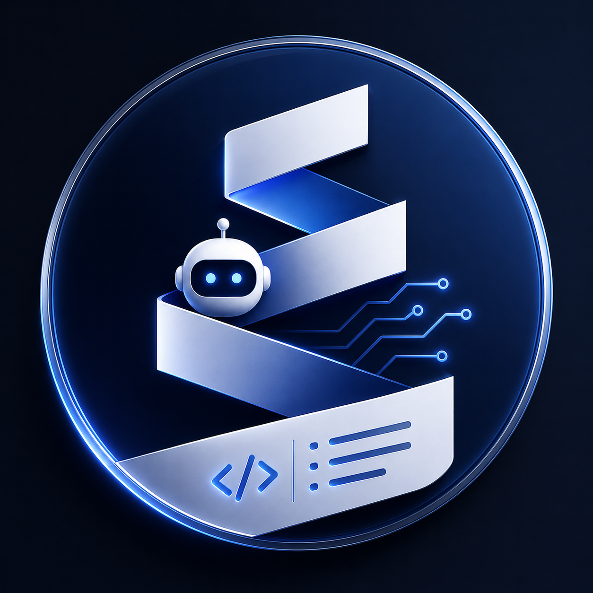

<div align="center">
  

  <p>Composable on-chain operation primitives for the <strong>Pharos Network</strong>, delivered as a CLI installer for AI code editors.</p>

  [](https://www.npmjs.com/package/pharos-skills)
  [](https://nodejs.org)
  [](LICENSE)
  [](https://soliditylang.org)
</div>

---

A **Pharos Skill** is a structured folder that AI agents (Claude Code, Cursor, opencode, Windsurf, etc.) read at runtime. Each skill ships with a `SKILL.md` capability index, exact `cast`/`forge` command references, and battle-tested Solidity contracts — so your agent knows exactly what to run without guessing.

## Skills

```
pharos-contract-verify   ──────────────────────────────── no deps
pharos-deploy-kit        ──→ pharos-contract-verify
pharos-token-factory     ──→ pharos-deploy-kit + pharos-contract-verify
pharos-safe-multisig     ──────────────────────────────── no deps
pharos-agent-wallet      ──────────────────────────────── no deps
pharos-x402-payments     ──→ pharos-agent-wallet
```

| Skill | What it does |
|-------|-------------|
| `pharos-contract-verify` | Verify any deployed Solidity contract on Pharos via Blockscout. Handles constructor args, compiler flags, and indexer retry. |
| `pharos-deploy-kit` | Deploy via `forge script` or deterministic CREATE2/CREATE3 for same-address-across-networks. Dry-run gate before any broadcast. |
| `pharos-token-factory` | Deploy ERC20/ERC721/ERC1155 tokens using audited OpenZeppelin v5 contracts. Mint, burn, pause, transfer ownership — with guardrails against dangerous combos. |
| `pharos-safe-multisig` | Deploy and manage Gnosis Safe multisigs. Treasury management, owner changes, contract ownership transfer to Safe. |
| `pharos-agent-wallet` | Autonomous wallet safety layer. Balance preflight, gas estimation, nonce management, per-session spend caps, and recipient allowlists. |
| `pharos-x402-payments` | Full x402 HTTP micropayment stack. Monetize Express endpoints as a server and pay autonomously as a client — with spend caps and idempotency built in. |

## Installation

```bash
npx pharos-skills add <skill>
```

The CLI prompts you to pick your editor(s) and install scope. Use **arrow keys** to move, **space** to select/deselect, and **enter** to confirm.

```bash
# Install a single skill (auto-resolves dependencies)
npx pharos-skills add pharos-token-factory

# Install all 6 skills at once
npx pharos-skills add-all

# Non-interactive / CI
npx pharos-skills add-all --yes

# Install into a specific directory
npx pharos-skills add pharos-token-factory --dir ./my-project

# Browse available skills
npx pharos-skills list

# Inspect a skill and its dependency tree
npx pharos-skills info pharos-x402-payments
```

### What gets installed

```
<target>/
├── SKILL.md                        ← merged Capability Index for all installed skills
└── .pharos/
    ├── shared/
    │   ├── assets/
    │   │   ├── networks.json       ← Pharos testnet + mainnet RPC, chain IDs, explorers
    │   │   ├── tokens.json         ← canonical token registry
    │   │   └── canonical-contracts.json
    │   └── references/
    │       └── _guardrails.md      ← mandatory pre-check protocol for all write ops
    └── skills/
        └── <skill-name>/
            ├── SKILL.md
            ├── skill.json
            ├── references/        ← exact command specs per operation
            └── assets/            ← contracts, scripts, templates
```

## Networks

| Network | Chain ID | RPC | Explorer |
|---------|----------|-----|----------|
| Atlantic Testnet *(default)* | `688689` | `https://atlantic.dplabs-internal.com` | [atlantic.pharosscan.xyz](https://atlantic.pharosscan.xyz) |
| Pacific Mainnet | `1672` | `https://rpc.pharos.xyz` | [pharosscan.xyz](https://www.pharosscan.xyz) |

> [!IMPORTANT]
> Every skill defaults to **Atlantic Testnet**. Any mainnet write operation requires an explicit "This is a MAINNET transaction with real value" confirmation — this cannot be skipped.

## Guardrails

Every skill enforces five non-negotiable safeguards:

1. **Foundry pre-check** — `which cast && which forge` before any command; prints install hint if missing.
2. **Explicit private key** — always `--private-key $PRIVATE_KEY`. Foundry does not auto-read env. Never hardcode, log, or echo keys.
3. **4-step Write Pre-Check** — derive sender → confirm chain ID → verify balance covers value + gas → simulate before send. Cannot be skipped.
4. **Testnet default + mainnet gate** — all skills default to testnet; mainnet requires explicit confirmation.
5. **Explorer link on every tx** — `<explorer>/tx/<hash>` and `<explorer>/address/<addr>` always output after broadcast.

## How an Agent Uses These Skills

1. Agent reads `SKILL.md` → scans the Capability Index for matching user intent
2. Opens the linked reference file (e.g., `pharos-token-factory/references/erc20.md#deploy`)
3. Follows the **Agent Guidelines** checklist at the bottom of each section
4. Runs Write Operation Pre-Checks from `_guardrails.md`
5. Executes exact `cast`/`forge` commands from the template
6. Outputs explorer links and records the result in a local ledger

## Development

**Prerequisites:** [Foundry](https://getfoundry.sh) · Node.js ≥ 20

```bash
# Install dependencies
npm install

# Build the CLI
npm run build

# Run CLI tests (22 tests, vitest 4)
npm test

# Compile Solidity contracts (solc 0.8.35 + OpenZeppelin v5.6.1)
cd contracts && forge build

# Run Solidity tests (15 tests)
cd contracts && forge test

# End-to-end install test
npx pharos-skills add pharos-token-factory --dir ./demo --yes
```

## Contracts

All contracts are in `contracts/src/`, compiled with **solc 0.8.35**, `via-ir`, and 200 optimizer runs.

| Contract | Description |
|----------|-------------|
| `StandardERC20.sol` | ERC20 + Burnable + Pausable + Capped + Ownable |
| `StandardERC721.sol` | ERC721 + URIStorage + Pausable + Ownable |
| `StandardERC1155.sol` | ERC1155 + Pausable + Supply + Ownable |
| `SpendLimitGuard.sol` | Gnosis Safe Guard — per-period cumulative spend cap |

> [!NOTE]
> Contracts are designed as reference implementations. Audit before using in production.

## Resources

- [Pharos Network docs](https://docs.pharos.xyz)
- [Foundry Book](https://book.getfoundry.sh)
- [OpenZeppelin Contracts v5](https://docs.openzeppelin.com/contracts/5.x/)
- [x402 Protocol](https://x402.org)
- [Gnosis Safe docs](https://docs.safe.global)
